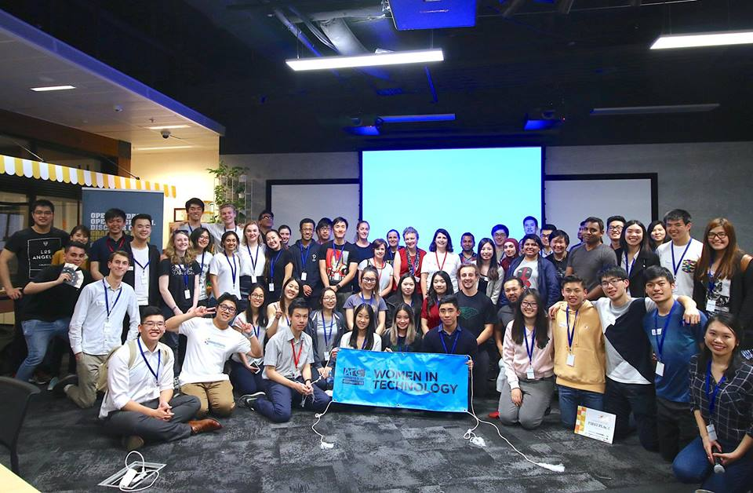

Our key focus is overcoming the barriers that face women in the IT industry by removing the stigma associated with the typically male-dominated industry. We aim to promote a more inclusive industry. As the first society at UNSW catering specifically to female students in technology, we aim to connect members to industry sponsors through a variety of relevant events and activities, and to ensure that these students are equipped with technical skills and knowledge to ensure they are ready to face the workplace at the completion of their university experience.
